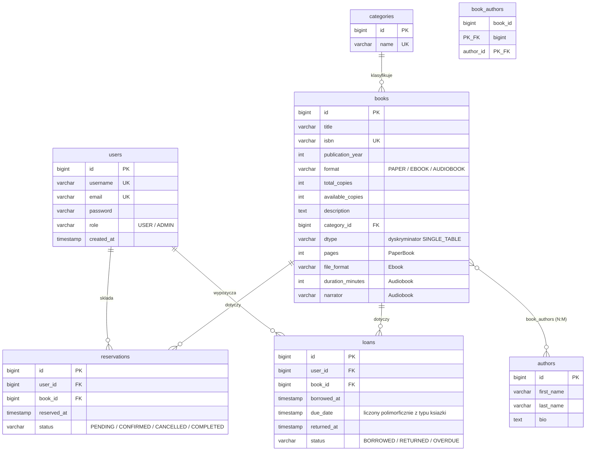

# 📚 Library-fo-ruina

System zarządzania księgarnią / wypożyczalnią książek — Java 25 + Spring Boot 4.

## Autorzy

| Imię i nazwisko | Nr indeksu | Rola |
|---|---|---|
| [Imię Nazwisko A] | [indeks] | Student A (Lider) |
| [Imię Nazwisko B] | [indeks] | Student B (Partner) |

## Technologie

- Java 25, Spring Boot 4.0.6
- Spring Security + JWT
- Hibernate + PostgreSQL
- Flyway (migracje V1–V7)
- Swagger / OpenAPI 3 (springdoc)
- JUnit 5 + Mockito + TestContainers
- JaCoCo (pokrycie ≥ 80%)
- Docker + Docker Compose, Maven

## Uruchomienie (Docker)

```bash
git clone https://github.com/Dzanek309/library-of-ruina
cd library-of-ruina
cp .env.example .env        # uzupelnij sekrety
docker-compose up --build
```

- Aplikacja: http://localhost:8080
- Swagger UI: http://localhost:8080/swagger-ui.html

## Uruchomienie lokalne (wymaga PostgreSQL)

```bash
./mvnw spring-boot:run
```

## Wzorce i OOP

### Polimorfizm
Abstrakcyjna klasa `Book` → `PaperBook`, `Ebook`, `Audiobook`. Każda nadpisuje
`getLoanPeriodDays()` (14 / 30 / 21 dni) i `getFormatInfo()`. Termin zwrotu
wypożyczenia liczony jest polimorficznie w `LoanService`.

### Wzorzec projektowy: Strategy
Interfejs `BookSearchStrategy` + implementacje `SearchByTitle`, `SearchByAuthor`,
`SearchByCategory`, `SearchByAvailable`. Endpoint: `GET /api/books/search?strategy=title&value=java`.

### Factory Method
`BookService.create()` tworzy odpowiednią podklasę `Book` na podstawie pola `format` żądania.

## Role (RBAC)

| Operacja | USER | ADMIN |
|---|---|---|
| Rejestracja / logowanie | ✅ | ✅ |
| Przeglądanie i wyszukiwanie książek | ✅ | ✅ |
| Rezerwacja książki | ✅ | ✅ |
| Wypożyczenie / zwrot | ✅ | ✅ |
| Historia własnych wypożyczeń | ✅ | ✅ |
| Dodawanie/edycja/usuwanie książek, autorów, kategorii | ❌ | ✅ |
| Podgląd wszystkich rezerwacji/wypożyczeń | ❌ | ✅ |
| Zarządzanie użytkownikami | ❌ | ✅ |

## Główne endpointy

### Auth
- `POST /api/auth/register` — rejestracja
- `POST /api/auth/login` — logowanie (zwraca JWT)

### Books
- `GET /api/books` — katalog
- `GET /api/books/{id}` — szczegóły
- `GET /api/books/search?strategy=...&value=...` — wyszukiwanie (Strategy)
- `GET /api/books/{id}/format-info` — opis formatu (polimorfizm)
- `POST /api/books` `PUT /api/books/{id}` `DELETE /api/books/{id}` — ADMIN

### Authors
- `GET /api/authors` — lista autorów
- `POST /api/authors` `PUT /api/authors/{id}` `DELETE /api/authors/{id}` — ADMIN

### Categories
- `GET /api/categories` — lista kategorii
- `POST /api/categories` `PUT /api/categories/{id}` `DELETE /api/categories/{id}` — ADMIN

### Reservations
- `GET /api/reservations` (ADMIN), `GET /api/reservations/user/{id}`
- `POST /api/reservations` — rezerwuj
- `PATCH /api/reservations/{id}/cancel`

### Loans
- `POST /api/loans/borrow` — wypożycz
- `PATCH /api/loans/{id}/return` — zwróć
- `GET /api/loans/user/{id}/history` — historia

### Users (ADMIN)
- `GET /api/users` — wszyscy użytkownicy
- `DELETE /api/users/{id}` — usuń użytkownika

## Testy

```bash
./mvnw clean test          # testy + agent JaCoCo
./mvnw jacoco:report       # raport: target/site/jacoco/index.html
./mvnw clean verify        # build padnie jesli pokrycie < 80%
```

## Diagram ERD

Schemat bazy odwzorowuje migracje Flyway V1–V7. Diagram renderuje się
automatycznie na GitHubie (Mermaid):



**Relacje:**
- `users` 1:N `reservations`, `users` 1:N `loans`
- `categories` 1:N `books` (książka ma jedną kategorię)
- `books` 1:N `reservations`, `books` 1:N `loans`
- `books` N:M `authors` (tabela pośrednia `book_authors`)
- `books` — dziedziczenie **SINGLE_TABLE**: `PaperBook` / `Ebook` / `Audiobook` (kolumna `dtype`)

<details>
<summary>Wersja tekstowa (gdyby Mermaid się nie wyrenderował)</summary>

```
┌──────────────┐         ┌──────────────────┐
│    users     │         │   reservations   │
├──────────────┤         ├──────────────────┤
│ PK id        │◄──1:N───│ PK id            │
│    username  │         │ FK user_id       │
│    email     │         │ FK book_id ──────┼──┐
│    password  │         │    reserved_at   │  │
│    role      │         │    status        │  │
│    created_at│         └──────────────────┘  │
└──────┬───────┘                               │
       │ 1:N                                   │
       │            ┌──────────────────┐       │
       └───────────►│      loans       │       │
                    ├──────────────────┤       │
                    │ PK id            │       │
                    │ FK user_id       │       │
                    │ FK book_id ──────┼───────┤
                    │    borrowed_at   │       │
                    │    due_date      │       │
                    │    returned_at   │       │
                    │    status        │       │
                    └──────────────────┘       │
                                               │
┌──────────────┐      ┌─────────────────┐      │
│  categories  │      │      books      │◄─────┘
├──────────────┤      ├─────────────────┤
│ PK id        │◄1:N──│ PK id           │
│    name      │      │ FK category_id  │
└──────────────┘      │    title        │        ┌──────────────┐
                      │    isbn         │        │   authors    │
                      │    format       │        ├──────────────┤
                      │    total_copies │  N:M   │ PK id        │
                      │    avail_copies │◄──────►│    first_name│
                      │    dtype        │        │    last_name │
                      │    pages        │        │    bio       │
                      │    file_format  │        └──────────────┘
                      │    duration_min │       (tabela posrednia
                      │    narrator     │        book_authors)
                      └─────────────────┘
```

</details>